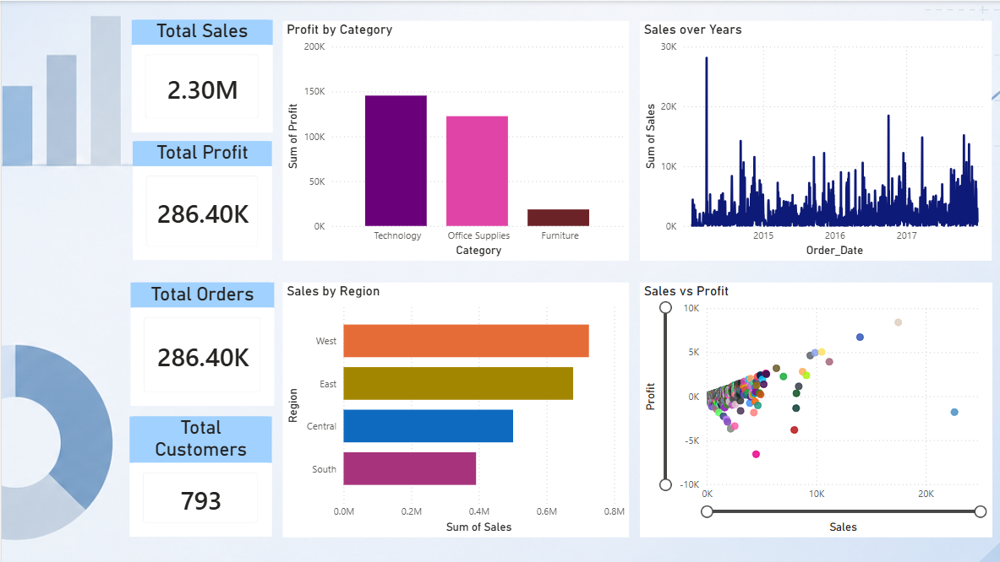
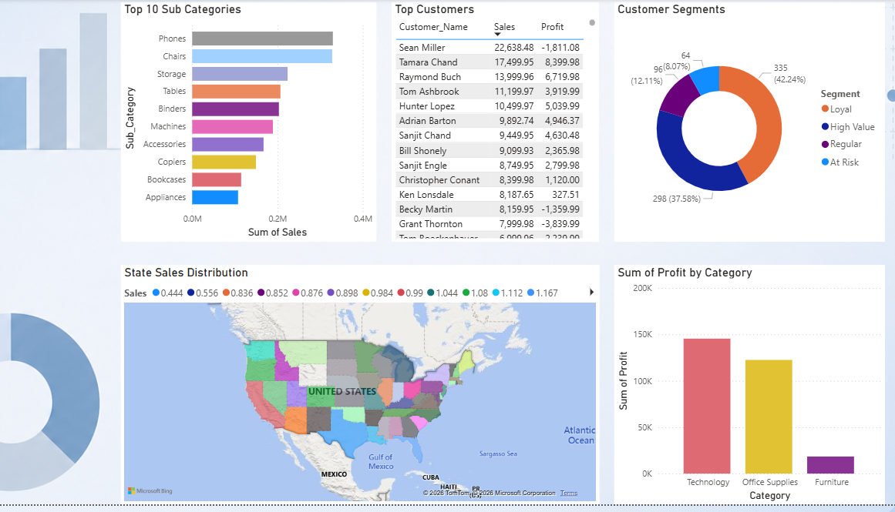

# Consumer Sales & Demand Intelligence Platform

## Project Overview

An end-to-end Business Intelligence and Advanced Analytics solution built on retail sales data to support data-driven decision making, customer analytics, profitability analysis, and sales forecasting.

The project simulates a real-world analytics workflow followed by Data Analysts and Business Intelligence teams in consumer goods organizations such as Henkel, Unilever, Beiersdorf, P&G, and Nestlé.

The solution covers the complete analytics lifecycle:

- Data Preparation & Validation
- Feature Engineering
- Exploratory Data Analysis
- SQL Analytics
- Customer Segmentation
- Machine Learning Forecasting
- Power BI Dashboarding
- Executive Business Reporting

---
# Dashboard Screenshots

## Overview



---

## Sales Analytics



---

## Dataset

### Sample Superstore Dataset

Source:
https://www.kaggle.com/datasets/vivek468/superstore-dataset-final

---

## Tech Stack

### Languages

- Python
- SQL

### Libraries

- Pandas
- NumPy
- Scikit-Learn
- Matplotlib
- Joblib

### BI & Visualization

- Power BI

### Database

- SQLite

### Version Control

- Git
- GitHub

---

# Project Architecture

```text
Raw Data
   │
   ▼
Data Cleaning
   │
   ▼
Data Validation
   │
   ▼
Feature Engineering
   │
   ▼
Exploratory Analysis
   │
   ├── SQL Analytics
   │
   ├── Customer Segmentation
   │
   ├── Machine Learning Forecasting
   │
   ▼
Power BI Dashboard

```

---

# Project Structure

```text
consumer-sales-intelligence/

├── data
│   ├── raw
│   └── processed
│
├── dashboard
│
├── models
│
├── notebooks
│
├── reports
│
├── sql
│
├── src
│
├── requirements.txt
│
└── README.md
```

---

# Data Engineering Pipeline

## Data Cleaning

Performed:

- Duplicate removal
- Date conversion
- Missing value handling
- Column standardization

## Data Validation

Validation checks:

- Null values
- Negative sales
- Missing customer identifiers
- Missing dates

Results:

```text
Sales Negative: 0
Null Sales: 0
Null Order Date: 0
Null Customer: 0
```

---

# Feature Engineering

Created business-ready features:

| Feature | Description |
|----------|----------|
| Year | Order Year |
| Month | Order Month |
| Quarter | Fiscal Quarter |
| Day | Day of Month |
| Weekday | Day Name |
| Ship_Days | Delivery Duration |

These features were later used for analytics and forecasting.

---

# Exploratory Data Analysis

## Key Performance Indicators

| KPI | Value |
|----------|----------|
| Total Sales | $2.30M |
| Total Profit | $286K |
| Total Orders | 5,009 |
| Total Customers | 793 |

---

## Sales by Region

| Region | Sales |
|----------|----------|
| West | $725K |
| East | $679K |
| Central | $501K |
| South | $392K |

### Insight

West region is the strongest revenue contributor.

---

## Sales by Category

| Category | Sales |
|----------|----------|
| Technology | $836K |
| Furniture | $742K |
| Office Supplies | $719K |

### Insight

Technology products drive the largest share of revenue.

---

## Profit by Category

| Category | Profit |
|----------|----------|
| Technology | $145K |
| Office Supplies | $122K |
| Furniture | $18K |

### Insight

Furniture generates strong sales but comparatively low profit.

---

# SQL Analytics Layer

Business queries implemented:

- Total Sales
- Total Profit
- Sales by Region
- Profit by Category
- Top Customers
- Top States

Database:

```text
SQLite
```

Purpose:

Provide a reusable analytics layer for reporting and dashboarding.

---

# Customer Segmentation

## RFM Analysis

Metrics:

### Recency

Days since last purchase.

### Frequency

Number of orders.

### Monetary

Total customer spend.

---

## K-Means Clustering

Customers segmented into:

| Segment | Customers |
|----------|----------|
| Loyal | 335 |
| High Value | 298 |
| Regular | 96 |
| At Risk | 64 |

### Business Value

- Identify high-value customers
- Improve retention strategies
- Enable targeted marketing campaigns

---

# Machine Learning Forecasting

## Objective

Predict sales using historical transaction data.

---

## Algorithm

Random Forest Regressor

---

## Features Used

- Quantity
- Discount
- Ship Days
- Year
- Month
- Quarter
- Product Attributes
- Regional Attributes

---

## Model Performance

| Metric | Value |
|----------|----------|
| MAE | 50.23 |
| RMSE | 266.09 |
| R² | 0.8177 |

### Interpretation

The model explains approximately 82% of sales variability and provides strong predictive performance for business planning.

---

# Feature Importance

| Feature | Importance |
|----------|----------|
| Month | 0.2377 |
| Quantity | 0.2056 |
| Year | 0.1889 |
| Ship_Days | 0.1742 |
| Discount | 0.1476 |
| Quarter | 0.0460 |

### Insight

Sales seasonality is one of the strongest drivers of performance.

---


